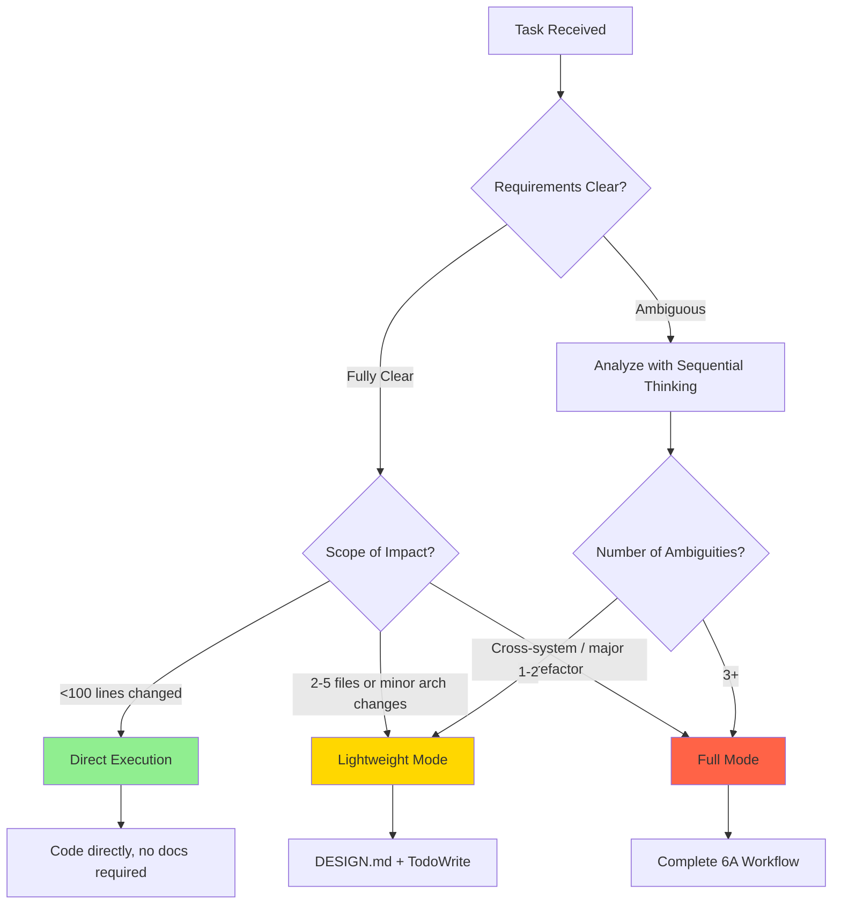

# AGENTS.md - OpenCode Configuration Repository

## Workflow Decision Framework

Before starting any task, determine the appropriate execution mode based on complexity.

### Mode Selection Flowchart



### Mode Comparison Table

| Dimension | Direct Execution | Lightweight Mode | Full Mode |
|-----------|------------------|------------------|-----------|
| **Code Changes** | <100 lines | 2-5 files | Multi-module |
| **Requirement Clarity** | 100% clear | 1-2 uncertainties | 3+ unknowns |
| **Architecture Impact** | None | Minor adjustments | Major changes |
| **Time Estimate** | <30 minutes | Half day to 2 days | 2+ days |
| **Documentation** | None | DESIGN.md | Full 6A docs |
| **Required Tools** | None mandatory | TodoWrite | Full toolchain |

### Mode Execution Details

#### Direct Execution
1. Confirm requirements and acceptance criteria
2. Prefer lightweight verification only: ESLint/LSP diagnostics and TypeScript checks
3. Implement code
4. Quick verification after lint/type checks pass

#### Lightweight Mode
1. **Deep analysis with Sequential Thinking**:
   - Validate requirement understanding
   - Identify potential ambiguities (1-2)
   - Confirm technical constraints
   - Define acceptance criteria
2. Create `docs/{task-name}/DESIGN.md` (architecture diagram + interfaces)
3. **Create task list with TodoWrite**
4. **Step-by-step implementation**:
   - Pre-execution check (verify input contract, environment, dependencies)
   - Implement core logic
   - Run targeted ESLint/LSP diagnostics and TypeScript checks
   - Update related documentation
   - Verify immediately after each task completion

5. **Quality Acceptance**:
   - [ ] All TodoWrite tasks completed
   - [ ] Code follows project conventions
   - [ ] No new `//DEBT:` markers
   - [ ] ESLint/LSP diagnostics are clean
   - [ ] TypeScript diagnostics are clean
   - [ ] All acceptance criteria met
   - [ ] Related documentation updated

#### Full Mode
Execute complete 6A Workflow (see 6A.md)

### Dynamic Upgrade Rules

Upgrade mode immediately when discovering these conditions:

**Direct Execution -> Lightweight Mode**:
- Need to modify 3+ files
- Conflict with existing architecture
- Need to clarify requirement boundaries

**Lightweight Mode -> Full Mode**:
- Need to change database schema
- Security/compliance risks identified
- Complex task dependencies (circular/parallel conflicts)
- Multi-system integration required

**Upgrade Procedure**:
1. Pause current execution
2. Inform user: "Detected [specific reason], recommend upgrading from [current] to [target] mode"
3. Wait for confirmation
4. Supplement necessary documentation and analysis

---

## Code Development Principles

### Design Philosophy
- **Moderate Design**: Reserve capacity based on business change frequency (typically 1.2-2x)
- **Reasonable Abstraction**: Consider abstracting after logic appears 3 times; evaluate abstraction benefits first
- **Patches Are Debt**: Handle edge cases through unified models; temporary if/else must be marked `//DEBT:`
- **Readability First**: Code is written for humans to read, machines to execute second

### Quality Requirements
- Strictly follow project's existing code conventions
- Maintain consistency with existing code style
- Use project's existing tools and libraries
- Reuse project's existing components
- Keep code concise and readable

---

## Tool Usage Guidelines

| Tool | Purpose | When to Use |
|------|---------|-------------|
| **TodoWrite** | Task tracking | Multi-file changes, multi-step tasks, real-time progress tracking |
| **Sequential Thinking** | Decision analysis | 3+ uncertainties, multiple viable solutions need weighing, complex system analysis |
| **Context7** | Technical reference | Latest API docs, framework-specific features, new technologies, best practices |
| **Playwright** | UI automation | Browser-level interaction verification, visual testing |
| **lsp_diagnostics** | Linting/Formatting | Standard LSP diagnostics for code quality |
| **xcommit** | Git operations | Atomic commits with automatic error fixing |

---

## Repository Structure
This repository contains configuration, skills, and commands for OpenCode agentic workflows.
- `opencode.json`: Core configuration for providers, models, and MCP servers.
- `oh-my-opencode.json`: Agent-specific model assignments and global settings.
- `skills/`: Modular packages extending agent capabilities with specialized logic.
  - `{skill}/SKILL.md`: Required entry point with metadata and instructions.
  - `{skill}/scripts/`: Executable Python/Bash scripts for deterministic tasks.
  - `{skill}/references/`: Domain-specific documentation and schemas.
  - `{skill}/assets/`: Templates, images, and boilerplate files.
- `commands/`: Markdown files defining slash commands and their workflows.
- `.sisyphus/`: Internal state and notepads for the Sisyphus execution engine.

## Build/Lint/Test Commands
The repository does not use a global build system. Agents should use standalone tools.
- Running Python scripts: `python skills/{skill}/scripts/{script}.py [args]`
- Validating Python syntax: `python -m py_compile skills/{skill}/scripts/{script}.py`
- Linting/Formatting: Use standard LSP diagnostics via `lsp_diagnostics`.
- Type checking: Prefer TypeScript/LSP diagnostics and targeted typecheck commands only.
- Default verification policy: Do not run full builds or full test suites for code-writing tasks unless the user explicitly asks.
- Avoid repository-wide heavy commands such as `build`, `test`, `test:all`, or similar by default.
- Git operations: Use `xcommit` for atomic commits with automatic error fixing.
- Manual verification: Execute scripts directly and inspect stdout/stderr.
- No global test framework: Test scripts individually using representative samples.

## Code Style Guidelines
### Python Scripts
Follow these patterns for consistency and reliability in agent-generated code.
- Imports: Order as standard library → third-party packages → local modules.
- Type hints: Required for all function signatures and class attributes.
- Docstrings: Use triple quotes (""") for modules, classes, and public functions.
- Naming: Use `snake_case` for files, functions, and variables; `PascalCase` for classes.
- Error handling: Use early returns and provide actionable, descriptive error messages.
- CLI structure: Check `sys.argv` length and print usage instructions if incorrect.
- Path handling: Always use `pathlib.Path` for cross-platform compatibility.
- Data structures: Prefer `dataclasses` for structured data containers.

### JavaScript (Limited Use)
- Syntax: Use ES6+ features (arrow functions, destructuring, template literals).
- Contexts: Primarily used for `html2pptx` logic or `p5.js` algorithmic art templates.

### Markdown (SKILL.md)
- Frontmatter: Must include `name` and `description` in YAML format.
- Description: Must be comprehensive as it serves as the primary triggering mechanism.
- Progressive disclosure: Keep `SKILL.md` lean; move details to `references/` files.
- Tone: Use imperative or infinitive form for instructions.

## Skill Development Guidelines
- Initialization: Use `python scripts/init_skill.py <name>` to create the structure.
- Determinism: Move repetitive or fragile logic into scripts instead of raw prompts.
- Context efficiency: Only include information that an AI agent cannot derive.
- Packaging: Run `python scripts/package_skill.py <path>` to validate and bundle.
- Validation: The packager checks frontmatter, directory structure, and references.
- Iteration: Refine skills based on performance in real-world tasks.

## Configuration Files
- `opencode.json`: Defines the `$schema`, active plugins, and provider model limits.
- `oh-my-opencode.json`: Maps agent roles (e.g., sisyphus, librarian) to specific models.
- `commands/*.md`: Defines slash commands using Markdown with YAML descriptions.

## Common Patterns
- JSON processing: Use `json.load()` and `json.dump()` with proper error handling.
- Path resolution: Use `Path(__file__).parent` to locate bundled resources.
- Actionable output: Scripts should print clear SUCCESS/FAILURE messages for agents.

## Git Workflow
- Use `xcommit` for all commits.
- Ensure atomic changes per commit.
- Follow the repository's commit message style.

## Important Notes
- No tests required: Focus on standalone reliability and manual verification.
- For code-writing tasks, default verification is limited to ESLint/LSP diagnostics and TypeScript checks unless the user explicitly requests broader validation.
- Context is a public good: Minimize token usage in instructions and references.
- Standalone scripts: Ensure scripts are self-contained or use relative imports.
- No emojis: Maintain a professional, concise tone without decorative elements.

### Detailed Python Style Examples
#### Import Order
```python
import json
import sys
from pathlib import Path

import imageio.v3 as imageio
import numpy as np

from .utilities import XMLEditor
```

#### Type Hints and Dataclasses
```python
@dataclass
class RectAndField:
    rect: list[float]
    rect_type: str
    field: dict
```

#### CLI Script Structure
```python
if __name__ == "__main__":
    if len(sys.argv) != 2:
        print("Usage: check_bounding_boxes.py [fields.json]")
        sys.exit(1)
    with open(sys.argv[1]) as f:
        messages = get_bounding_box_messages(f)
```

### Detailed Skill Structure
#### SKILL.md Frontmatter
```yaml
---
name: skill-name
description: Comprehensive description of what the skill does and when to use it.
---
```

#### Directory Layout
- `scripts/`: `rotate_pdf.py`, `validate_schema.py`
- `references/`: `api_docs.md`, `schemas.json`
- `assets/`: `logo.png`, `template.docx`

### Progressive Disclosure Patterns
- **Pattern 1**: High-level guide in `SKILL.md` with links to `references/`.
- **Pattern 2**: Domain-specific organization (e.g., `references/aws.md`, `references/gcp.md`).
- **Pattern 3**: Conditional details (e.g., "For tracked changes, see REDLINING.md").

### JSON Configuration Reference
#### opencode.json
- `plugin`: List of active plugins.
- `provider`: Model definitions and limits.
- `mcp`: Remote or local MCP server configurations.

#### oh-my-opencode.json
- `agents`: Mapping of agent roles to specific models.
- `google_auth`: Boolean flag for Google authentication.

### Final Reminders
- Keep `SKILL.md` under 500 lines.
- Use `pathlib.Path` for all file operations.
- Test scripts by running them before packaging.
- Avoid redundant documentation files like `README.md` inside skills.

<skills_system priority="1">

## Available Skills

<!-- SKILLS_TABLE_START -->
<usage>
When users ask you to perform tasks, check if any of the available skills below can help complete the task more effectively. Skills provide specialized capabilities and domain knowledge.

How to use skills:
- Invoke: Bash("openskills read <skill-name>")
- The skill content will load with detailed instructions on how to complete the task
- Base directory provided in output for resolving bundled resources (references/, scripts/, assets/)

Usage notes:
- Only use skills listed in <available_skills> below
- Do not invoke a skill that is already loaded in your context
- Each skill invocation is stateless
</usage>

<available_skills>

<skill>
<name>algorithmic-art</name>
<description>Creating algorithmic art using p5.js with seeded randomness and interactive parameter exploration. Use this when users request creating art using code, generative art, algorithmic art, flow fields, or particle systems. Create original algorithmic art rather than copying existing artists' work to avoid copyright violations.</description>
<location>global</location>
</skill>

<skill>
<name>brand-guidelines</name>
<description>Applies Anthropic's official brand colors and typography to any sort of artifact that may benefit from having Anthropic's look-and-feel. Use it when brand colors or style guidelines, visual formatting, or company design standards apply.</description>
<location>global</location>
</skill>

<skill>
<name>canvas-design</name>
<description>Create beautiful visual art in .png and .pdf documents using design philosophy. You should use this skill when the user asks to create a poster, piece of art, design, or other static piece. Create original visual designs, never copying existing artists' work to avoid copyright violations.</description>
<location>global</location>
</skill>

<skill>
<name>doc-coauthoring</name>
<description>Guide users through a structured workflow for co-authoring documentation. Use when user wants to write documentation, proposals, technical specs, decision docs, or similar structured content. This workflow helps users efficiently transfer context, refine content through iteration, and verify the doc works for readers. Trigger when user mentions writing docs, creating proposals, drafting specs, or similar documentation tasks.</description>
<location>global</location>
</skill>

<skill>
<name>docx</name>
<description>"Comprehensive document creation, editing, and analysis with support for tracked changes, comments, formatting preservation, and text extraction. When Claude needs to work with professional documents (.docx files) for: (1) Creating new documents, (2) Modifying or editing content, (3) Working with tracked changes, (4) Adding comments, or any other document tasks"</description>
<location>global</location>
</skill>

<skill>
<name>frontend-design</name>
<description>Create distinctive, production-grade frontend interfaces with high design quality. Use this skill when the user asks to build web components, pages, artifacts, posters, or applications (examples include websites, landing pages, dashboards, React components, HTML/CSS layouts, or when styling/beautifying any web UI). Generates creative, polished code and UI design that avoids generic AI aesthetics.</description>
<location>global</location>
</skill>

<skill>
<name>internal-comms</name>
<description>A set of resources to help me write all kinds of internal communications, using the formats that my company likes to use. Claude should use this skill whenever asked to write some sort of internal communications (status reports, leadership updates, 3P updates, company newsletters, FAQs, incident reports, project updates, etc.).</description>
<location>global</location>
</skill>

<skill>
<name>mcp-builder</name>
<description>Guide for creating high-quality MCP (Model Context Protocol) servers that enable LLMs to interact with external services through well-designed tools. Use when building MCP servers to integrate external APIs or services, whether in Python (FastMCP) or Node/TypeScript (MCP SDK).</description>
<location>global</location>
</skill>

<skill>
<name>pdf</name>
<description>Comprehensive PDF manipulation toolkit for extracting text and tables, creating new PDFs, merging/splitting documents, and handling forms. When Claude needs to fill in a PDF form or programmatically process, generate, or analyze PDF documents at scale.</description>
<location>global</location>
</skill>

<skill>
<name>pptx</name>
<description>"Presentation creation, editing, and analysis. When Claude needs to work with presentations (.pptx files) for: (1) Creating new presentations, (2) Modifying or editing content, (3) Working with layouts, (4) Adding comments or speaker notes, or any other presentation tasks"</description>
<location>global</location>
</skill>

<skill>
<name>skill-creator</name>
<description>Guide for creating effective skills. This skill should be used when users want to create a new skill (or update an existing skill) that extends Claude's capabilities with specialized knowledge, workflows, or tool integrations.</description>
<location>global</location>
</skill>

<skill>
<name>slack-gif-creator</name>
<description>Knowledge and utilities for creating animated GIFs optimized for Slack. Provides constraints, validation tools, and animation concepts. Use when users request animated GIFs for Slack like "make me a GIF of X doing Y for Slack."</description>
<location>global</location>
</skill>

<skill>
<name>template</name>
<description>Replace with description of the skill and when Claude should use it.</description>
<location>global</location>
</skill>

<skill>
<name>theme-factory</name>
<description>Toolkit for styling artifacts with a theme. These artifacts can be slides, docs, reportings, HTML landing pages, etc. There are 10 pre-set themes with colors/fonts that you can apply to any artifact that has been creating, or can generate a new theme on-the-fly.</description>
<location>global</location>
</skill>

<skill>
<name>web-artifacts-builder</name>
<description>Suite of tools for creating elaborate, multi-component claude.ai HTML artifacts using modern frontend web technologies (React, Tailwind CSS, shadcn/ui). Use for complex artifacts requiring state management, routing, or shadcn/ui components - not for simple single-file HTML/JSX artifacts.</description>
<location>global</location>
</skill>

<skill>
<name>webapp-testing</name>
<description>Toolkit for interacting with and testing local web applications using Playwright. Supports verifying frontend functionality, debugging UI behavior, capturing browser screenshots, and viewing browser logs.</description>
<location>global</location>
</skill>

<skill>
<name>xlsx</name>
<description>"Comprehensive spreadsheet creation, editing, and analysis with support for formulas, formatting, data analysis, and visualization. When Claude needs to work with spreadsheets (.xlsx, .xlsm, .csv, .tsv, etc) for: (1) Creating new spreadsheets with formulas and formatting, (2) Reading or analyzing data, (3) Modify existing spreadsheets while preserving formulas, (4) Data analysis and visualization in spreadsheets, or (5) Recalculating formulas"</description>
<location>global</location>
</skill>

</available_skills>
<!-- SKILLS_TABLE_END -->

</skills_system>
