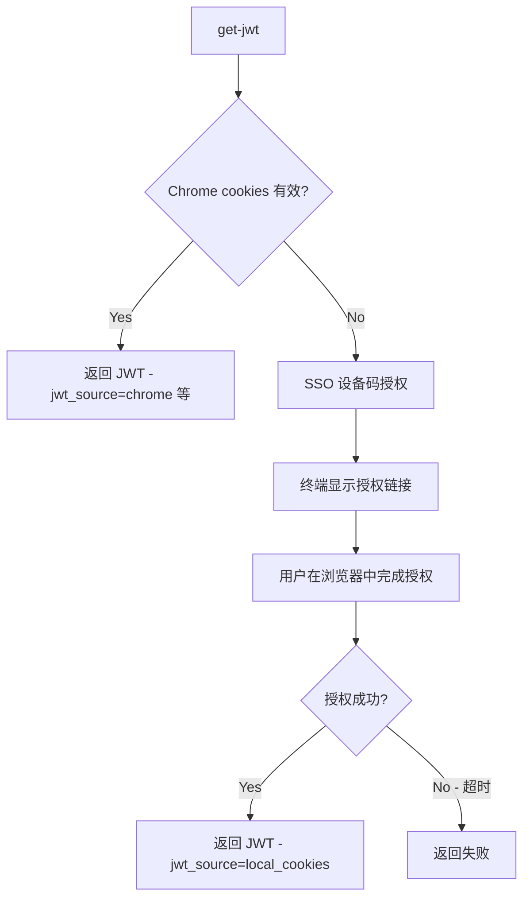

# ByteDance JWT Token Skill

通过 byte-cli 获取 ByteDance JWT Token，支持多区域。优先从 Chrome 浏览器 cookies 自动换取，浏览器未登录时自动降级为 SSO 设备码授权流程。

## Installation (一次性设置)

1. **检查是否已安装**:
   ```bash
   byte-cli --version  # 如果输出版本号，说明已安装，跳过步骤 2
   ```

2. **安装 byte-cli（如果未安装）**:
   ```bash
   uv tool install --index https://bytedpypi.byted.org/simple --force \
     "git+https://code.byted.org/bytedance/byte-skill.git#subdirectory=byte-cli"
   ```

3. **验证安装成功**:
   ```bash
   byte-cli --version  # 确认安装成功
   which byte-cli      # 查看安装路径
   ```

## 支持的区域

| 区域代码 | 名称 | 域名 |
|----------|------|------|
| cn (默认) | 中国 | https://cloud.bytedance.net |
| boe | 测试环境 | https://cloud-boe.bytedance.net |
| i18n-tt | 国际TT | https://cloud.tiktok-row.net |
| i18n-bd | 国际BD | https://cloud.byteintl.net |
| eu-ttp | 欧洲TTP | https://cloud.tiktok-row.net |
| us-ttp | 美国TTP | https://cloud-ttp-us.bytedance.net |

## 认证流程



## 执行步骤

### 步骤 1：获取 JWT

```bash
byte-cli login --control-plane <control_plane> get-jwt
```

**输出解析：**

- 成功（从 Chrome cookies 换取）：
  ```json
  {
    "success": true,
    "data": {
      "jwt": "eyJhbGciOiJSUzI1NiIsInR5cCI6IkpXVCJ9.eyJzdWIiOi..."
    },
    "jwt_source": "chrome"
  }
  ```

- 成功（从 SSO 本地缓存换取）：
  ```json
  {
    "success": true,
    "data": {
      "jwt": "eyJhbGciOiJSUzI1NiIsInR5cCI6IkpXVCJ9.eyJzdWIiOi..."
    },
    "jwt_source": "local_cookies"
  }
  ```
  → **完成！** `data.jwt` 就是完整的 JWT token，直接返回给用户。

- SSO 授权（Chrome cookies 未找到时自动触发，输出到 stderr）：
  ```
  未找到浏览器 Cookie，启动 SSO 认证...
  请在浏览器中打开以下链接完成授权：
    https://sso.bytedance.com/device?user_code=XXXX-XXXX
  等待授权中...
  ```
  → 继续步骤 2，引导用户完成授权。

- 失败（exit code 1）：
  ```json
  {
    "success": false,
    "message": "未找到有效会话，请在 Chrome 中打开 https://cloud.bytedance.net 登录后重试。"
  }
  ```
  → 继续步骤 3。

### 步骤 2：引导用户完成 SSO 授权

当 stderr 中出现授权链接时，告知用户：

> 请在浏览器中打开以下链接完成授权：`<verification_uri_complete>`
>
> 打开后按提示登录并点击授权，完成后 JWT 将自动获取。

用户完成授权后，命令会自动返回 JWT，流程结束。

### 步骤 3：引导用户登录 Chrome（双重失败时）

若 Chrome cookies 和 SSO 均不可用，告知用户选择其一：

- **方案 A（Chrome）**：用 Chrome 打开对应区域的 Cloud 控制台并登录，然后重新执行步骤 1。
- **方案 B（SSO）**：在终端重新执行步骤 1，按提示完成 SSO 授权。

## 完整示例

### 场景：用户请求获取 JWT

**用户：** "帮我获取一个 bytedance jwt token"

**执行流程：**

```bash
# 1. 直接获取（默认 cn 区域）
byte-cli login --control-plane cn get-jwt
```

如果 `success: true`，直接把 `data.jwt` 返回给用户，流程结束。

如果输出 SSO 授权链接（stderr），告知用户打开链接完成授权，等待命令自动完成。

如果 `success: false`，告知用户：
> 请用 Chrome 打开 https://cloud.bytedance.net 并登录，登录后我再帮你获取 JWT。

用户确认登录后，再次执行：

```bash
byte-cli login --control-plane cn get-jwt
```

## 使用 JWT Token

获取到完整 JWT 后，可用于 ByteDance 内部服务的 API 调用：

```python
headers = {
    "X-Jwt-Token": jwt_token,
    # 或者
    "Authorization": f"Bearer {jwt_token}"
}
```

## 错误处理

| 错误信息 | 原因 | 解决方案 |
|----------|------|----------|
| `success: false` + 未找到有效会话 | Chrome 未登录且 SSO 授权超时/失败 | 用 Chrome 登录或重新执行 SSO 流程 |
| SSO 授权超时 | 用户未在规定时间内完成授权 | 重新执行命令，及时完成授权 |
| `Unknown control_plane` | 区域代码无效 | 使用有效的区域代码 |
| 网络错误 | 无法访问服务 | 检查网络连接和 VPN |
| `command not found: byte-cli` | byte-cli 未安装 | 参考安装步骤 |

## 注意事项

1. byte-cli 优先从 Chrome 浏览器提取 cookies 换取 JWT，无需手动操作
2. Chrome cookies 不可用时，自动降级为 SSO 设备码授权（需要用户在浏览器中完成一次授权）
3. SSO 授权成功后，token 会缓存到本地（`~/.byte_cli/auth/`），后续调用自动续期，无需重复授权
4. `jwt_source` 字段说明 JWT 的来源：`chrome`/`firefox` 等表示浏览器，`local_cookies` 表示本地 SSO 缓存
